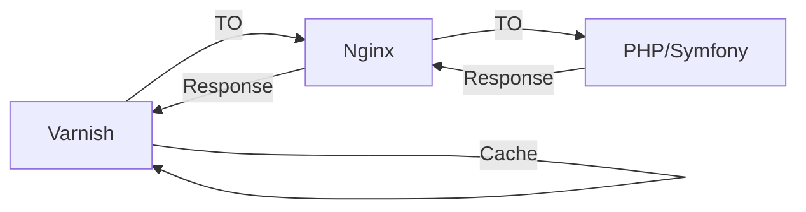
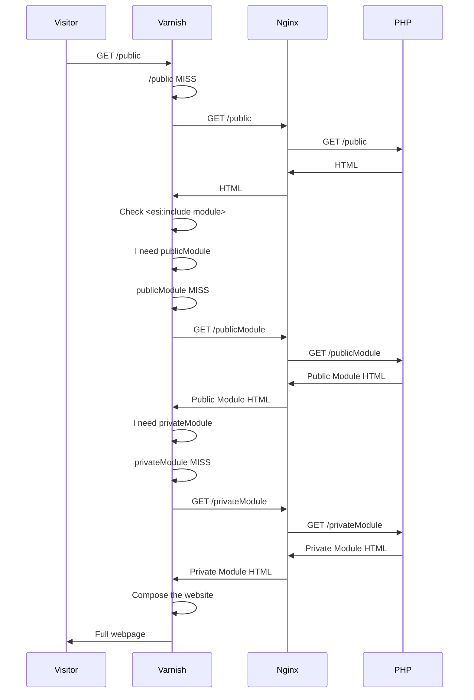
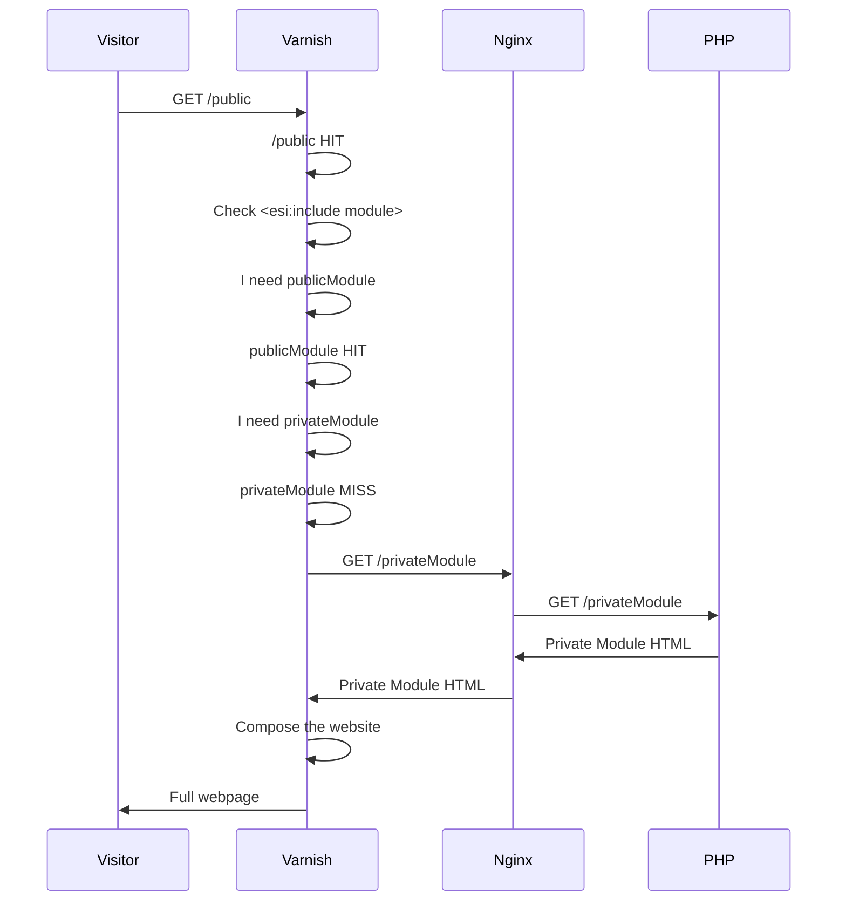
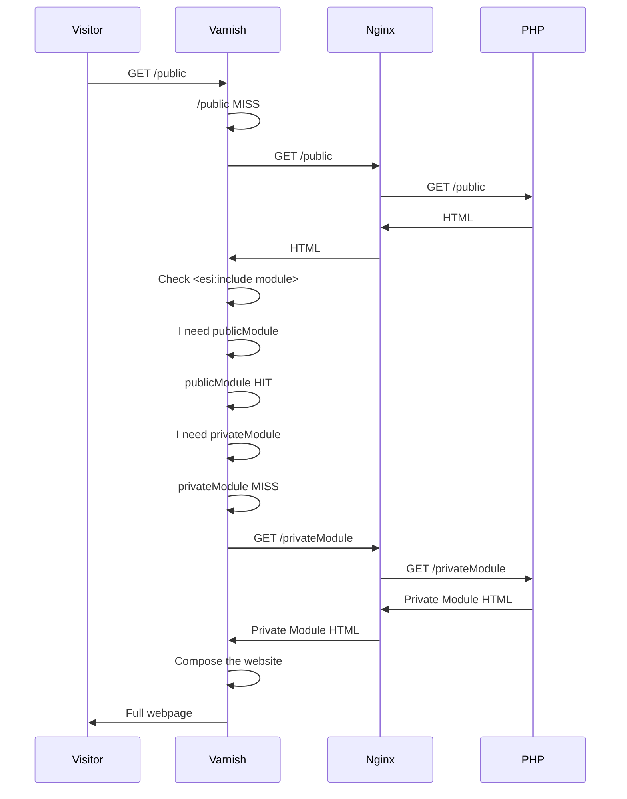

# Varnish Cache Testing Proyect
**Varnish Cache** es un acelerador de aplicaciones web que funciona como un proxy inverso, es decir, se coloca entre el cliente y el servidor web. Así, cada vez que un cliente solicita un recurso web, Varnish lo devuelve directamente desde la memoria en vez de tener que reconstruir el recurso.

Además de la funcionalidad básica de caché, ofrece soporte para [ESI](https://en.wikipedia.org/wiki/Edge_Side_Includes), que permite cachear "por partes" una web completa. Con el fin de poder determinar su funcionamiento concreto y su forma de explotación, se crea este proyecto (que es más una prueba de concepto). Se determinará la forma de funcionamiento básica de caché, el uso de ESI y cómo borrar o invalidad recursos.


## Puesta en marcha

El proyecto se pone en marcha gracias a Docker, que nos ahorra tener que instalar el stack en nuestras máquinas. Para arrancarlo, descargue el repositorio de Git y arranquelo con docker-compose
```bash  
git clone https://github.com/junisan/varnish-cache-testing-proyect.git
cd varnish-cache-testing-proyect  
docker-compose up  
```  

## Infraestructura
El núcleo del sistema es un contenedor de docker php-fpm 7.4 sobre alpine. En este contenedor se ejecuta la aplicación montada sobre Symfony 4.4. En él encontrarás básicamente la configuración del framework, el controlador y los templates. No se han modificado más opciones por defecto ni implementado más servicios como bases de datos, redis, etc.

Antes de este contenedor, se deberá pasar a través de un Nginx, que hace las veces de servidor proxy. Cada vez que se solicita una web, la petición alcanza Nginx y este, la solicita a PHP FPM. Está escuchando en el puerto 8080 de la máquina. Se ha dejado el puerto abierto para hacer un bypass a Varnish y poder hacer pruebas libremente.

Por último, y como primer contenedor a la escucha, se encuentra Varnish en el puerto 8000. Si bien es posible solicitar los recursos a Nginx, el ciclo completo de una petición en producción debería ir vía Varnish.


# Experimentos en cuanto a rendimiento

## Planteamiento
Para hacer la prueba de concepto se ha creado un microsite que contiene una página principal o home, un artículo público (completamente cacheable) y un artículo privado (que nunca debe ser cacheado). Ambos artículos incluyen un módulo (o aside) que es público para la caché. Es sobre este módulo sobre el que se hacen las pruebas de ESI: en ambos artículos se inserta el siguiente código
```twig  
{#Se inserta el fragmento ESI al módulo público#}  
{{ render_esi(controller('App\\Controller\\DefaultController::publicModule'))}}    
{#Se inserta el fragmento ESI al módulo privado #}  
{{ render_esi(controller('App\\Controller\\DefaultController::privateModule'))}}  
{#Se renderiza el código HTML escapado para debug#}  
{{ render_esi(controller('App\\Controller\\DefaultController::publicModule')) | escape}}    
{{ render_esi(url('publicModule')) | escape }}  
```  
> render_esi es una función de Twig que permite renderizar la página de forma habitual si no detecta un proxy esi-compatible o insertar el fragmento ESI en caso contrario

## Resultados

La primera vez que se accede a la página pública no se encuentra el contenido cacheado, por lo que Varnish sigue la cadena de petición (Nginx -> PHP) hasta renderizar la página completa. Una vez está renderizada y es devuelta a Varnish, este analiza el resultado en búsqueda de fragmentos ESI (en este caso, los módulos públicos y premium). Varnish hace una segunda petición a Nginx -> PHP para obtener el HTML de este módulo. Una vez que este módulo ha vuelto a Varnish, este lo incluye en remplazo de la etiqueta ESI y devuelve la página completa (artículo y módulo) al visitante.


[![](https://mermaid.ink/img/eyJjb2RlIjoic2VxdWVuY2VEaWFncmFtICBcblZpc2l0b3IgLT4-IFZhcm5pc2g6IEdFVCAvcHVibGljICBcblZhcm5pc2ggLT4-IFZhcm5pc2g6IC9wdWJsaWMgTUlTUyAgXG5WYXJuaXNoIC0-PiBOZ2lueDogR0VUIC9wdWJsaWMgIFxuTmdpbnggLT4-IFBIUDogR0VUIC9wdWJsaWMgIFxuUEhQIC0-PiBOZ2lueDogSFRNTCAgXG5OZ2lueCAtPj4gVmFybmlzaDogSFRNTCAgXG5WYXJuaXNoIC0-PiBWYXJuaXNoOiBDaGVjayA8ZXNpOmluY2x1ZGUgbW9kdWxlPiAgXG5WYXJuaXNoIC0-PiBWYXJuaXNoOiBJIG5lZWQgcHVibGljTW9kdWxlICBcblZhcm5pc2ggLT4-IFZhcm5pc2g6IHB1YmxpY01vZHVsZSBNSVNTICBcblZhcm5pc2ggLT4-IE5naW54OiBHRVQgL3B1YmxpY01vZHVsZSAgXG5OZ2lueCAtPj4gUEhQOiBHRVQgL3B1YmxpY01vZHVsZSAgXG5QSFAgLT4-IE5naW54OiBQdWJsaWMgTW9kdWxlIEhUTUwgIFxuTmdpbnggLT4-IFZhcm5pc2g6IFB1YmxpYyBNb2R1bGUgSFRNTCAgXG5WYXJuaXNoIC0-PiBWYXJuaXNoOiBJIG5lZWQgcHJpdmF0ZU1vZHVsZSAgXG5WYXJuaXNoIC0-PiBWYXJuaXNoOiBwcml2YXRlTW9kdWxlIE1JU1MgIFxuVmFybmlzaCAtPj4gTmdpbng6IEdFVCAvcHJpdmF0ZU1vZHVsZSAgXG5OZ2lueCAtPj4gUEhQOiBHRVQgL3ByaXZhdGVNb2R1bGUgIFxuUEhQIC0-PiBOZ2lueDogUHJpdmF0ZSBNb2R1bGUgSFRNTCAgXG5OZ2lueCAtPj4gVmFybmlzaDogUHJpdmF0ZSBNb2R1bGUgSFRNTCAgXG5WYXJuaXNoIC0-PiBWYXJuaXNoOiBDb21wb3NlIHRoZSB3ZWJzaXRlICBcblZhcm5pc2ggLT4-IFZpc2l0b3I6IEZ1bGwgd2VicGFnZSAgIiwibWVybWFpZCI6eyJ0aGVtZSI6ImRlZmF1bHQifSwidXBkYXRlRWRpdG9yIjpmYWxzZSwiYXV0b1N5bmMiOnRydWUsInVwZGF0ZURpYWdyYW0iOmZhbHNlfQ)](https://mermaid-js.github.io/mermaid-live-editor/edit##eyJjb2RlIjoiZ3JhcGggVERcbiAgICBBW0NocmlzdG1hc10gLS0-fEdldCBtb25leXwgQihHbyBzaG9wcGluZylcbiAgICBCIC0tPiBDe0xldCBtZSB0aGlua31cbiAgICBDIC0tPnxPbmV8IERbTGFwdG9wXVxuICAgIEMgLS0-fFR3b3wgRVtpUGhvbmVdXG4gICAgQyAtLT58VGhyZWV8IEZbZmE6ZmEtY2FyIENhcl1cbiAgIiwibWVybWFpZCI6IntcbiAgXCJ0aGVtZVwiOiBcImRlZmF1bHRcIlxufSIsInVwZGF0ZUVkaXRvciI6ZmFsc2UsImF1dG9TeW5jIjp0cnVlLCJ1cGRhdGVEaWFncmFtIjpmYWxzZX0)

En este caso, se puede ver como es necesario hacer tres peticiones secuenciales (ya que no se pueden paralelizar). Por tanto, la primera vez que se pide un recurso web, la respuesta es más lenta que sin Varnish, pues hay que esperar a que Varnish obtenga la página principal, el primer ESI y posteriormente el segundo. Tras finalizar esta prueba, tanto la página completa (al ser pública) como el HTML del módulo público (al ser también público) está cacheado en Varnish. Sin embargo el módulo privado no estará cacheado.
> Se ha determinado que los ESI no se obtienen de forma paralela añadiendo sleep(5) a la función que pinta el módulo privado y el público. Si fuese paralelo, la composición habría tardado en torno a los 5 segundos (definido como el máximo de A y B). Sin embargo, la composición tardó alrededor de 10 segundos (definido como A+B).

Si volvemos a solicitar el recurso antes de que se expire la página principal, vemos que Varnish devuelve la versión cacheada de esta página y la versión cacheada del módulo público. Sin embargo, Varnish vuelve a hacer una petición para obtener el código del módulo privado:

[](https://mermaid-js.github.io/mermaid-live-editor/edit##eyJjb2RlIjoic2VxdWVuY2VEaWFncmFtICBcblZpc2l0b3IgLT4-IFZhcm5pc2g6IEdFVCAvcHVibGljICBcblZhcm5pc2ggLT4-IFZhcm5pc2g6IC9wdWJsaWMgTUlTUyAgXG5WYXJuaXNoIC0-PiBOZ2lueDogR0VUIC9wdWJsaWMgIFxuTmdpbnggLT4-IFBIUDogR0VUIC9wdWJsaWMgIFxuUEhQIC0-PiBOZ2lueDogSFRNTCAgXG5OZ2lueCAtPj4gVmFybmlzaDogSFRNTCAgXG5WYXJuaXNoIC0-PiBWYXJuaXNoOiBDaGVjayA8ZXNpOmluY2x1ZGUgbW9kdWxlPiAgXG5WYXJuaXNoIC0-PiBWYXJuaXNoOiBJIG5lZWQgcHVibGljTW9kdWxlICBcblZhcm5pc2ggLT4-IFZhcm5pc2g6IHB1YmxpY01vZHVsZSBNSVNTICBcblZhcm5pc2ggLT4-IE5naW54OiBHRVQgL3B1YmxpY01vZHVsZSAgXG5OZ2lueCAtPj4gUEhQOiBHRVQgL3B1YmxpY01vZHVsZSAgXG5QSFAgLT4-IE5naW54OiBQdWJsaWMgTW9kdWxlIEhUTUwgIFxuTmdpbnggLT4-IFZhcm5pc2g6IFB1YmxpYyBNb2R1bGUgSFRNTCAgXG5WYXJuaXNoIC0-PiBWYXJuaXNoOiBJIG5lZWQgcHJpdmF0ZU1vZHVsZSAgXG5WYXJuaXNoIC0-PiBWYXJuaXNoOiBwcml2YXRlTW9kdWxlIE1JU1MgIFxuVmFybmlzaCAtPj4gTmdpbng6IEdFVCAvcHJpdmF0ZU1vZHVsZSAgXG5OZ2lueCAtPj4gUEhQOiBHRVQgL3ByaXZhdGVNb2R1bGUgIFxuUEhQIC0-PiBOZ2lueDogUHJpdmF0ZSBNb2R1bGUgSFRNTCAgXG5OZ2lueCAtPj4gVmFybmlzaDogUHJpdmF0ZSBNb2R1bGUgSFRNTCAgXG5WYXJuaXNoIC0-PiBWYXJuaXNoOiBDb21wb3NlIHRoZSB3ZWJzaXRlICBcblZhcm5pc2ggLT4-IFZpc2l0b3I6IEZ1bGwgd2VicGFnZSAgIiwibWVybWFpZCI6IntcbiAgXCJ0aGVtZVwiOiBcImRlZmF1bHRcIlxufSIsInVwZGF0ZUVkaXRvciI6ZmFsc2UsImF1dG9TeW5jIjp0cnVlLCJ1cGRhdGVEaWFncmFtIjpmYWxzZX0)

En este caso vemos que cada URL forma una entidad viva en Varnish: es decir, aunque un recurso contenga un ESI, ese ESI será una entidad viva que no dependa de su padre. Esto quiere decir que si en una página incluimos x módulos privados, tendremos que hacer x llamadas. Es decir, que a excepción de la página principal, __no estamos cacheando nada__. Es más, estamos perjudicando el rendimiento porque las llamadas a dichos módulos no son paralelas.

> Esto nos deja una enseñanza a aplicar: JAMÁS se debe usar una configuración privada en un ESI. Si se necesitase incluir un módulo privado, incluirlo vía AJAX, pero nunca vía Varnish o ESI.

Una vez que ha caducado la página principal pero no la caché del módulo, alguien vuelve a pedir el recurso. El camino es el siguiente:

[](https://mermaid-js.github.io/mermaid-live-editor/edit##eyJjb2RlIjoic2VxdWVuY2VEaWFncmFtXG5WaXNpdG9yIC0-PiBWYXJuaXNoOiBHRVQgL3B1YmxpY1xuVmFybmlzaCAtPj4gVmFybmlzaDogL3B1YmxpYyBISVRcblZhcm5pc2ggLT4-IFZhcm5pc2g6IENoZWNrIDxlc2k6aW5jbHVkZSBtb2R1bGU-XG5WYXJuaXNoIC0-PiBWYXJuaXNoOiBJIG5lZWQgcHVibGljTW9kdWxlXG5WYXJuaXNoIC0-PiBWYXJuaXNoOiBwdWJsaWNNb2R1bGUgSElUXG5WYXJuaXNoIC0-PiBWYXJuaXNoOiBJIG5lZWQgcHJpdmF0ZU1vZHVsZVxuVmFybmlzaCAtPj4gVmFybmlzaDogcHJpdmF0ZU1vZHVsZSBNSVNTXG5WYXJuaXNoIC0-PiBOZ2lueDogR0VUIC9wcml2YXRlTW9kdWxlXG5OZ2lueCAtPj4gUEhQOiBHRVQgL3ByaXZhdGVNb2R1bGVcblBIUCAtPj4gTmdpbng6IFByaXZhdGUgTW9kdWxlIEhUTUxcbk5naW54IC0-PiBWYXJuaXNoOiBQcml2YXRlIE1vZHVsZSBIVE1MXG5WYXJuaXNoIC0-PiBWYXJuaXNoOiBDb21wb3NlIHRoZSB3ZWJzaXRlXG5WYXJuaXNoIC0-PiBWaXNpdG9yOiBGdWxsIHdlYnBhZ2UiLCJtZXJtYWlkIjoie1xuICBcInRoZW1lXCI6IFwiZGVmYXVsdFwiXG59IiwidXBkYXRlRWRpdG9yIjpmYWxzZSwiYXV0b1N5bmMiOnRydWUsInVwZGF0ZURpYWdyYW0iOmZhbHNlfQ)  
En este caso vemos que Varnish requiere la página principal y el módulo premium, pues el módulo público lo sigue teniendo cacheado. Si nos olvidamos del módulo privado (del cual se ha comentado que es preferible no incluirlo) vemos que solo sería necesario regenerar la página principal (el contenido de la noticia por ejemplo) pero no los módulos auxiliares.

## Conclusiones
En base a los resultados obtenidos, extraemos conclusiones adaptables a otros proyectos más complejos:

- Varnish obtiene la página principal y los extractos ESI de forma secuencial, por lo que, a menos números de módulos, más rápido servirá la web completa.
- Varnish trata los fragmentos ESI como _entidades propias_ del sistema: cachear una página no significa cachear los fragmentos de esta. Por ello, si una URL contenida en un ESI es privada, nunca será cacheada y siempre que se visite el recurso, Varnish lo obtendrá de nuevo.
- En base a lo anterior y desde el punto de vista del rendimiento, se deben evitar ESI privados.
- La primera vez que se visite un recurso (o si tanto la página principal como el contenido es privado), el tiempo de respuesta será extremadamente largo en comparación con no usar proxy. Sin embargo, cacheando absolutamente todo (y cargando los módulos privados por alguna forma alternativa), es posible servir las páginas de forma inmediata.